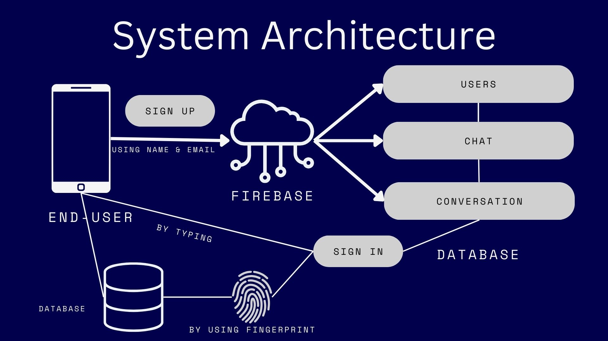

# **SAMVAD - Talk to Anyone**

## **Introduction**

**SAMVAD** is an Android-based mobile application developed using **Android Studio**, **Java**, **XML**, and **Firebase**. The app is designed to provide an accessible and user-friendly platform for seamless communication, particularly for users who may have visual impairments. SAMVAD incorporates voice-driven commands, a user-friendly interface, and a range of communication features, such as SOS emergency calls, voice messaging, and location sharing.

## **Features**

- **Voice-driven Interaction**: Users can navigate the app, send messages, and perform actions using voice commands.
- **Audio Guide for UI Navigation**: Provides audio feedback for visually impaired users to guide them through the app.
- **SOS Emergency Button**: Users can quickly call for help by pressing the SOS button in case of emergencies.
- **Speech-to-Text Messaging**: Convert voice commands to text messages, which can then be sent within the chat interface.
- **Fingerprint Authentication**: Provides easy and secure login without the need to type in credentials.
- **Location Sharing**: Share real-time GPS location with other users.
- **Push Notifications**: Firebase Cloud Messaging (FCM) is used for detailed push notifications with sound descriptions.
- **Multimedia Sharing**: Share text, images, and voice messages seamlessly.

## **System Architecture**



The system utilizes **Firebase** as the backend to manage users, chat functionality, and conversations. End-users interact with the system either by typing or by using their voice, and they can log in securely using fingerprint authentication.

## **Database Architecture**


The database architecture is built using Firebase, where user data, chat messages, and conversation history are stored. This ensures real-time data synchronization between users.

## **FCM (Firebase Cloud Messaging) Architecture**


FCM is used to handle push notifications in the app. Notifications are sent to the user's device when a new message is received or in case of other events. This ensures users are always notified of important updates.

## **UI & Features Overview**

### **Login and Sign-up**


- **Sign-in**: Users can sign in securely using fingerprint authentication or traditional email and password.
- **Sign-up**: New users can create accounts either via form submission or by using their Google account.

### **Home Page**


The home page contains the following:
- **SOS Button**: Allows users to call for emergency help.
- **Guide Button**: Provides an audio guide to help users navigate the app.
- **New Chat**: Start a new conversation with any of the available contacts.
- **Logout**: Logout from the app securely.

### **Chat Page**


The chat interface includes:
- **Voice Commands**: Users can send voice messages, share their location, or dictate messages to be converted to text.
- **Message Readout**: The app reads out the latest message in the conversation for users who prefer audio over visual interaction.

### **UI Navigation**


The app offers a streamlined and easy-to-use interface, ensuring smooth navigation through various features, including chat, message readout, and multimedia sharing.

## **Installation Instructions**
1. **Clone the Repository**:

   ```bash
   git clone https://github.com/pp11-web/SAMVAD-Talk-to-anyone.git
   ```

2. **Open in Android Studio**:  
   Import the project into Android Studio.

3. **Set up Firebase**:  
   - Create a Firebase project and enable Firebase Authentication, Cloud Messaging, and Realtime Database.
   - Add the `google-services.json` file to the app directory.

4. **Build and Run**:  
   Build the project and deploy it on an Android emulator or device.

## **Contributing**

We welcome contributions to improve SAMVAD! To contribute:

1. **Fork the repository**.
2. **Create a new branch**:

   ```bash
   git checkout -b feature/your-feature
   ```

3. **Commit your changes**:

   ```bash
   git commit -m "Add your feature"
   ```

4. **Push to the branch**:

   ```bash
   git push origin feature/your-feature
   ```

5. **Open a Pull Request**.

## **Acknowledgements**

This project was developed by:

- **Rajdeep Savani** - 19BCT0100
- **Aatman Prajapati** - 19BCT0183
- **Prayag Purani** - 19BCE2054

We would like to thank our mentors and everyone who contributed to the success of this project.

## **License**

This project is licensed under the MIT License. See the [LICENSE](LICENSE) file for more information.


